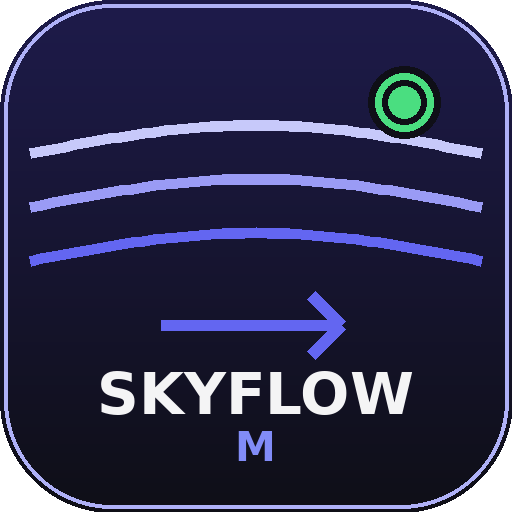

<div align="center">



# SKYFLOW VPN

### Защищённый VPN для Android с двумя режимами работы

<br>

[](https://github.com/vlad4endev/skyflow-vpn-android/releases)
[](https://github.com/vlad4endev/skyflow-vpn-android)
[](https://kotlinlang.org)
[](https://golang.org)
[](LICENSE)

<br>

**SKYFLOW VPN** — Android-приложение для защищённого интернета.<br>
Два режима: ⚡ **Скоростной** через VLESS/Xray и ☁ **Белый список** через WireGuard over VK TURN/DTLS.<br>
Подписка от **300 ₽/мес** — купить через [@skypathvpn_bot](https://t.me/skypathvpn_bot)

</div>

---

## 📱 Скриншоты

<div align="center">

| ⚡ Скоростной режим | ☁ Белый список | 🖥 Серверы | 📋 Диагностика | ℹ️ О приложении |
|:---:|:---:|:---:|:---:|:---:|
|  |  |  |  |  |

</div>

---

## ✨ Возможности

<table>
<tr>
<td width="50%">

### ⚡ Скоростной режим
- **VLESS + Xray** — современный прокси-протокол
- **WebSocket / Reality / TLS** — обфускация трафика
- **hev-socks5-tunnel** — TUN через SOCKS5 JNI
- **Автовыбор сервера** — тест через YouTube
- **Latency badge** — реальный пинг для каждого сервера
- **Проверка YouTube** — ✅/❌ доступность per-server

</td>
<td width="50%">

### ☁ Белый список
- **WireGuard GoBackend** — ядро wireguard-go
- **VK TURN/DTLS** — туннель через relay VK-звонков
- **RTP AEAD обфускация** — маскировка под WebRTC
- **HKDF WRAP-ключи** — деривация из пароля, не в APK
- **До 4 VK-хешей** — до 108 потоков параллельно
- **Авто Smart Captcha** — Go v2 → Auto WebView → ручной

</td>
</tr>
<tr>
<td>

### 🔀 Авто-режим
- Wi-Fi → **Скоростной** автоматически
- LTE/5G → **Белый список** автоматически
- Переключение при смене сети без ручного выбора

</td>
<td>

### 🛡 Подписка
- Серверы загружаются по ссылке с `skypath.fun`
- Авто-обновление каждые 5 минут
- Показ трафика, срока действия, анонса
- Компактный чип в режиме белого списка

</td>
</tr>
<tr>
<td>

### 📊 Диагностика
- Live-лог с группировкой повторов и счётчиками
- Фильтры: Путь / VPS / VK / Релей / Ошибки
- Визуальная цепочка `APP→VK→RELAY→VPS→VPN`
- Этапы подключения, активные воркеры, потоки

</td>
<td>

### 🚀 Маршрутизация
- **Глобальный** — весь трафик через прокси
- **Без России** — РФ напрямую, зарубеж через VPN
- **Только прокси** — максимальная защита
- Переключение без переподключения

</td>
</tr>
</table>

---

## 🏗 Архитектура

```
┌─────────────────────────────────────────────────────────────────────┐
│                        SKYFLOW VPN Android                          │
│                                                                     │
│  ┌─────────┐    ┌──────────┐    ┌──────────────────────────────┐   │
│  │ Compose │───▶│TunnelMgr │───▶│  SPEED MODE                  │   │
│  │   UI    │    │          │    │  Xray VLESS ──▶ SOCKS5       │   │
│  └─────────┘    │          │    │  hev-socks5-tunnel (JNI/TUN) │   │
│                 │          │    └──────────────────────────────┘   │
│  ┌──────────┐   │          │    ┌──────────────────────────────┐   │
│  │Settings  │───▶ VpnSvc  │───▶│  WHITELIST MODE              │   │
│  │  Store   │    │          │    │  Go-client WDTT              │   │
│  └──────────┘    │          │    │  WRAP/RTP AEAD               │   │
│                 └──────────┘    │  VK TURN/DTLS ──▶ WireGuard  │   │
│                                 └──────────────────────────────┘   │
└─────────────────────────────────────────────────────────────────────┘
         │                                    │
         ▼                                    ▼
  sub.skypath.fun                    VK TURN Relay
  VLESS серверы                  ──▶ wdtt-server VPS
                                     WireGuard ──▶ 🌐
```

---

## 🚀 Быстрый старт

### 1. Установка

Скачайте актуальный APK со **[страницы релизов](https://github.com/vlad4endev/skyflow-vpn-android/releases)** и установите на Android 9.0+.

### 2. Покупка подписки

Напишите боту **[@skypathvpn_bot](https://t.me/skypathvpn_bot)** — он выдаст ссылку подписки и ключи доступа.

> 💜 **300 ₽ / месяц** · Безлимитный трафик · Мгновенная активация

### 3. Подключение

**Скоростной режим (Wi-Fi):**
1. В разделе **«Серверы»** вставьте ссылку подписки `https://sub.skypath.fun/...`
2. Серверы загрузятся автоматически
3. Нажмите кнопку питания — подключение занимает 2–3 секунды

**Белый список (LTE/5G):**
1. Вставьте ссылку VK-звонка `vk.com/call/join/...`  
   или нажмите **«⚡ Создать автоматически»**
2. Нажмите кнопку питания

> **Авто-режим** сам выбирает правильный режим при смене Wi-Fi ↔ LTE

---

## 📦 Стек технологий

| Слой | Технологии |
|------|-----------|
| **UI** | Kotlin · Jetpack Compose · Material 3 · Inter |
| **VPN** | Android VpnService · WireGuard GoBackend |
| **Speed mode** | Xray-core · hev-socks5-tunnel (JNI) · VLESS/WS/Reality |
| **Whitelist mode** | Go 1.25 · DTLS · RTP AEAD · ChaCha20-Poly1305 · HKDF |
| **Subscription** | VLESS subscription format · Base64/JSON |
| **Storage** | DataStore Preferences |
| **Arch** | Single-activity · Coroutines · StateFlow · ViewModel-free |

---

## 🔒 Безопасность

- **Нет логов активности** — трафик не записывается
- **WRAP-ключи из HKDF** — ключ выводится из пароля, не захардкожен в APK
- **Домен белого списка** — подписки только с `skypath.fun`
- **RTP AEAD обфускация** — трафик маскируется под WebRTC аудио
- **Исключения приложений** — тонкая настройка что идёт через VPN
- **VK и сам SKYFLOW** — автоматически исключены из туннеля

---

## 📁 Структура проекта

```
app/src/main/java/com/wdtt/client/
├── ui/
│   ├── TunnelTab.kt           # Главный экран — кнопка питания, режимы
│   ├── ServersScreen.kt       # Управление серверами и подпиской
│   ├── SubscriptionSetupScreen.kt  # Первоначальная настройка подписки
│   ├── ExclusionsScreen.kt    # Исключения приложений
│   └── InfoScreen.kt          # Диагностика и информация
├── xray/
│   ├── Tun2SocksHelper.kt     # JNI hev-socks5-tunnel (Speed mode)
│   ├── XrayHelper.kt          # Управление Xray процессом
│   ├── ServerTester.kt        # Тест серверов через YouTube
│   ├── SubscriptionParser.kt  # Парсинг VLESS-подписок
│   └── VlessModels.kt         # Модели данных
├── TunnelManager.kt           # Оркестратор туннеля
├── TunnelService.kt           # Android VpnService
├── SettingsStore.kt           # DataStore хранилище
└── MainActivity.kt            # Единственная Activity
go_client/                     # Go нативный клиент (Whitelist mode)
scripts/                       # Сборочные скрипты
```

---

## 🛠 Сборка из исходников

```bash
# Требования: Android Studio Hedgehog+, JDK 17, Go 1.25+, NDK r26+

# 1. Клонируй репозиторий
git clone https://github.com/vlad4endev/skyflow-vpn-android.git
cd proxy-turn-vk-android

# 2. Собери нативный Go-клиент
./scripts/build-native.sh

# 3. Собери нативный Speed-режим (hev-socks5-tunnel)
./scripts/build-native-speed.sh

# 4. Собери APK
./gradlew assembleRelease
```

---

## 📄 Лицензия

Распространяется под лицензией **[GNU General Public License v3.0](LICENSE)**.

---

<div align="center">

Сделано с 💜 командой **SKYFLOW**

**[📲 Скачать APK](https://github.com/vlad4endev/skyflow-vpn-android/releases)** · **[✈ Купить подписку](https://t.me/skypathvpn_bot)** · **[🐛 Сообщить о баге](https://github.com/vlad4endev/skyflow-vpn-android/issues)**

</div>
